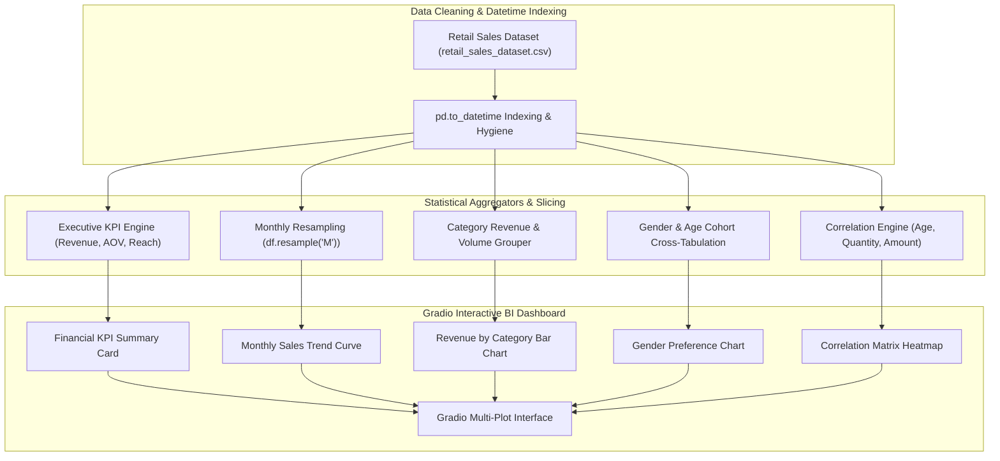

<br/><br/>

<!-- Animated Title -->
<p align="center">
  <a href="#">
    
  </a>
</p>

<p align="center">
  <b>Enterprise Retail Sales Intelligence & Demographic Customer Analytics Platform</b><br/>
  <i>Executive Financial KPIs · Monthly Time-Series Resampling · Gender & Age Cohort Segmentation · Product Revenue Distribution · Interactive Gradio BI Studio</i>
</p>

<br/>

<!-- Badges Row 1: Core Technologies -->
<p align="center">
  
  
  
  
  
</p>

<!-- Badges Row 2: Standards & Status -->
<p align="center">
  
  
  
</p>

<br/>

<!-- Quick Navigation Bar -->
<p align="center">
  <a href="#-overview"></a>
  &nbsp;
  <a href="#-problem-statement--bi-solution"></a>
  &nbsp;
  <a href="#-executive-kpis--metrics"></a>
  &nbsp;
  <a href="#%EF%B8%8F-analytical-architecture"></a>
  &nbsp;
  <a href="#-demographic--sales-insights"></a>
  &nbsp;
  <a href="#-quickstart--execution"></a>
</p>

---

## 📌 Overview

**Retail Sales and Customer Demographics Analysis** is an enterprise business intelligence (BI) and exploratory data mining platform designed to unpack transaction dynamics across multi-category retail operations.

Analyzing transaction records from the benchmark **Retail Sales Dataset**, the system computes foundational financial KPIs (Total Revenue, Unique Customer Count, Average Order Value), calculates monthly time-series sales velocity, models category revenue distributions across gender and age demographics, and wraps all visualizations inside an interactive **Gradio Executive Dashboard**.

```
                      ┌────────────────────────────────────────────────────────┐
                      │             Retail Intelligence Engine                 │
                      │                                                        │
[ Transaction Log:   ]┼──> [ Datetime Resampling & Indexing ]                  ├──> [ Executive BI Dashboard ]
[ Price, Qty, Gender ]│             │                                          │    - Total Revenue ($)
                      │             ▼                                          │    - Average Transaction Value
                      │    [ Statistical Aggregation Engine ]                  │    - Monthly Sales Curve
                      │       ├── Demographic Cohort Slicing                   │    - Category Breakdown
                      │       ├── Product Revenue Contribution Matrix          │    - Correlation Matrix
                      │       └── Correlation Heatmaps                         │    - Interactive Gradio App
                      └────────────────────────────────────────────────────────┘
```

---

## 🎯 Problem Statement & BI Solution

<table>
<tr>
<td width="50%" valign="top">

### ❌ The Retail Visibility Blindspot

Retail executives frequently lack unified visibility into operational performance:

- 📊 **Fragmented Revenue Reporting**: Aggregating revenue across disparate branches and product categories often takes days.
- 👥 **Superficial Demographics**: High-level sales totals conceal which specific age and gender cohorts drive margin versus volume.
- 📉 **Seasonality Blindspots**: Difficulty identifying cyclical month-over-month peaks and troughs.
- 🕳️ **Basket Size Ambiguity**: Unclear relationship between unit pricing, purchase quantities, and total order values.

</td>
<td width="50%" valign="top">

### ✅ The Analytical Solution

| Challenge | Applied Engineering Solution |
| :--- | :--- |
| **Instant Executive KPIs** | Computes **Total Revenue**, **Unique Customers**, **Transaction Count**, and **AOV** automatically. |
| **Time-Series Decomposition** | **Datetime Resampling (`M`)** charts monthly sales trajectories and identifies peak purchasing seasons. |
| **Demographic Breakdown** | Cross-tabulates **Product Category** preferences against **Gender** and **Age** cohorts. |
| **Interactive BI Delivery** | **Gradio Dashboard** consolidates 8 distinct visual analytical plots into an interactive browser studio. |

</td>
</tr>
</table>

---

## 🔥 Executive KPIs & Metrics

The platform synthesizes core operational metrics for retail decision-makers:

| Metric Indicator | Scope | Strategic Business Value |
| :--- | :--- | :--- |
| **Total Revenue** | Cumulative monetary turnover | Top-line financial scale and revenue velocity tracking. |
| **Unique Customer Count** | Distinct customer identities | Measures active customer reach and acquisition effectiveness. |
| **Total Transactions** | Total processed checkout events | Operational throughput and store foot-traffic volume. |
| **Average Order Value (AOV)** | Mean total spend per transaction | Direct benchmark for cross-selling and bundling effectiveness. |

---

## 🏗️ Analytical Architecture



---

## ⚙️ Technical Stack

| Component | Technology | Purpose & Implementation |
| :--- | :--- | :--- |
| **Core Language** | **Python 3.10+** | Data wrangling and statistical computing |
| **Data Structures** | **Pandas & NumPy** | Datetime index manipulation, resampling, and aggregations |
| **Visual Analytics** | **Seaborn & Matplotlib** | Multi-faceted distribution plotting and correlation matrices |
| **BI Interface** | **Gradio** | Interactive browser dashboard orchestrating 8 visual plots |
| **Runtime Environment** | **Jupyter Notebook** | Interactive 34-cell analytical notebook |

---

## 📁 Repository Structure

```
Retail_Sales_and_Customer_Demographics_Analysis/
├── 📄 analysis-retail-sales.ipynb      # Complete 34-cell BI analysis & Gradio dashboard notebook
├── 📊 retail_sales_dataset.csv         # Retail sales transaction records dataset
└── 📄 README.md                        # Documentation
```

---

## 🚀 Quickstart & Execution

### Prerequisites
- **Python**: 3.10 or higher
- **Jupyter Notebook**: Recommended

---

### 1. Installation

```bash
# 1. Clone repository
git clone https://github.com/IbrahimAbdelsattar/Retail_Sales_and_Customer_Demographics_Analysis.git
cd Retail_Sales_and_Customer_Demographics_Analysis

# 2. Create virtual environment
python -m venv venv
source venv/bin/activate        # On Windows: .\venv\Scripts\activate

# 3. Install packages
pip install numpy pandas seaborn matplotlib gradio jupyter
```

---

### 2. Running the Business Intelligence Notebook

```bash
jupyter notebook analysis-retail-sales.ipynb
```

*Execute all notebook cells to calculate the financial KPIs and launch the embedded Gradio interactive analytics dashboard.*

---

## 👥 Author & Connect

**Ibrahim Abdelsattar**  
*AI Engineer & Machine Learning Specialist*

- 🌐 **GitHub**: [@IbrahimAbdelsattar](https://github.com/IbrahimAbdelsattar)
- 💼 **LinkedIn**: [Ibrahim Abdelsattar](https://www.linkedin.com/in/ibrahim-abdelsattar/)
- 📧 **Email**: [ibrahimabdelsattar042@gmail.com](mailto:ibrahimabdelsattar042@gmail.com)

---

<p align="center">
  <sub>Engineered for retail analytics, customer demographics, and business intelligence. © 2026 Retail Sales Analysis.</sub>
</p>
